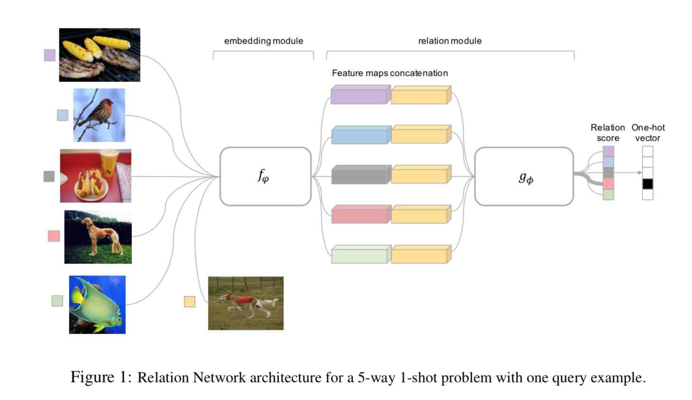
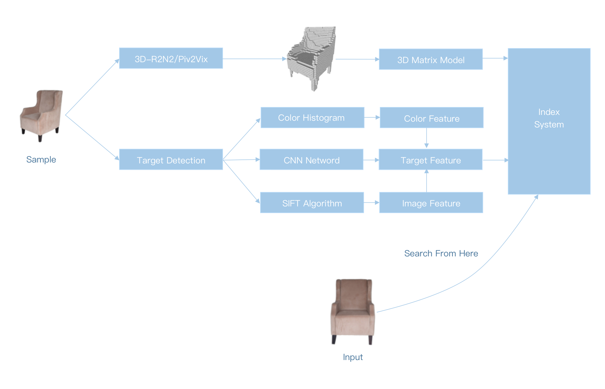
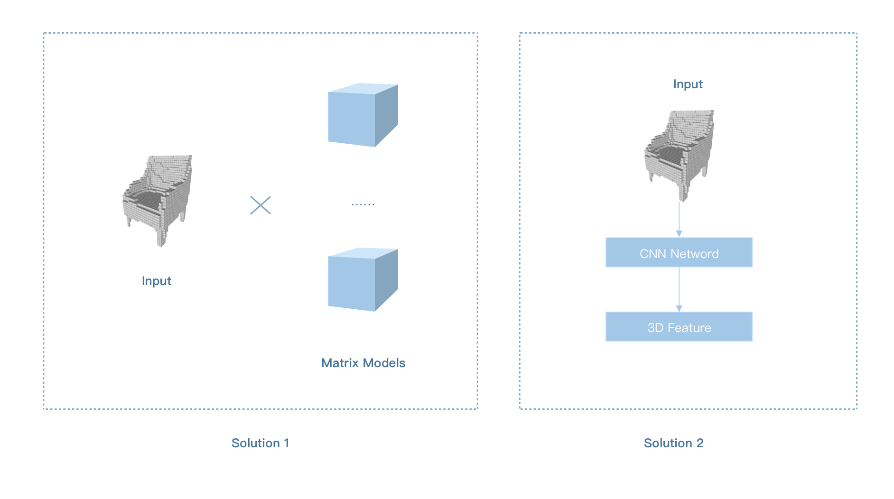

## Recognize Components By Just One Photo

### Abstract

Nowadays,  artificial intelligence is widely used in image recognition, enabling computers recognize objects through photos. Large-scale datasets is required for most recognition models, such as CNN (Convolutional Neural Network) and RNN (Recurrent Neural Network), which are the main models in deep learning. However, in many cases, only a few shots can be used to train recognition models.

As a result, zero/one/few shot learning was born. Nevertheless, few shot learning is now only applied to recognize targets like animals whose edge features are easily to identify. Nearly nobody has put forward a solution, which can identify "standard target" (like lamp, which consist of square and cylinder) with only few samples.

Taobao, the China's e-commerce leader, has also applied a similar approach for product recognition. They have extracted features from pictures existed on they platform and built index system. Once customer upload a picture, they will use CNN models to extract picture's features and search target using index system. However, this system won't work without enough image features. Either, It can hardly give right matches if pictures are not taken in the same direction. Therefore, the algorithm is not able to identify aircraft components in IPC manual with just one photo.

In order to solve this problem, we put forward a between solution which can recognize target by 3D-reconstruction, 3D feature and 2D feature. 

### Structure

As we know, an object can be presented by three-digit array which can transformed into a same basic array no matter how it is posed, while it maybe will definitely not the same as in 2D world. This is the reason why we consider using 3D object to realize this algorithm. Besides, using CNN and image hash algorithm to find similar pictures is a very mature technology now.

So, we have built a system using not only 2D features but also 3D space features.

### Explanation

#### 2D feature

We mainly use CNN and [ImageHash](https://github.com/JohannesBuchner/imagehash) to achieve.

#### 3D feature 

We have tried matrix models to compute the rotation results which can be compared with origin model while it is too slow. The model to extract 3D feature using CNN is being tested now.

#### 3D Reconstruction

This technology is mature now. We use Pix2Vix, R2N2, Occupancy Networks to achieve real picture reconstruction.

**Contact:** tjyangshan@gmail.com 

**Author:** Sean