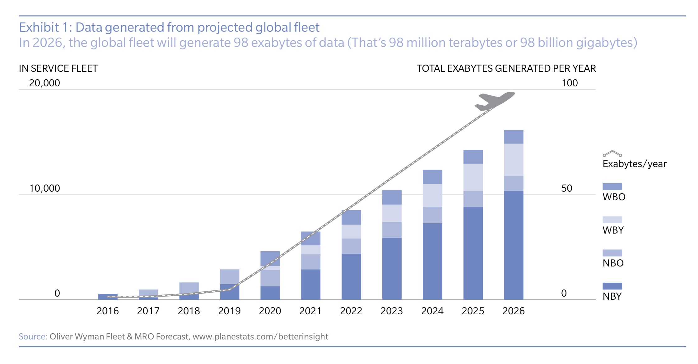
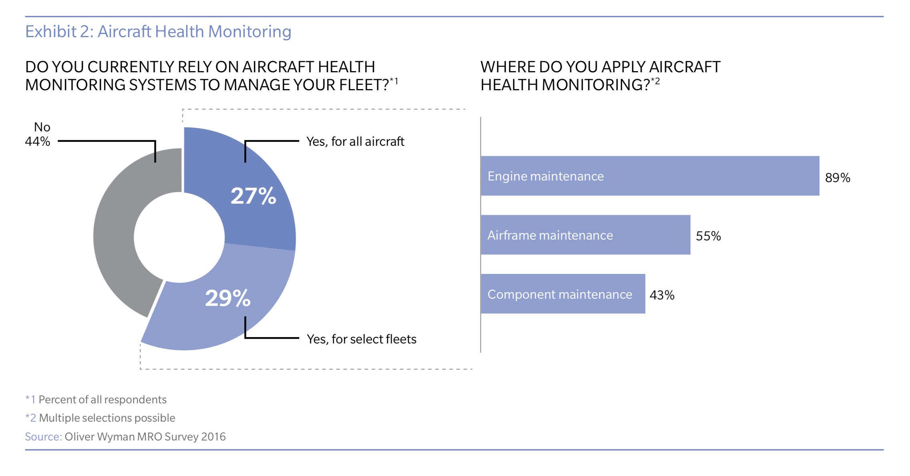
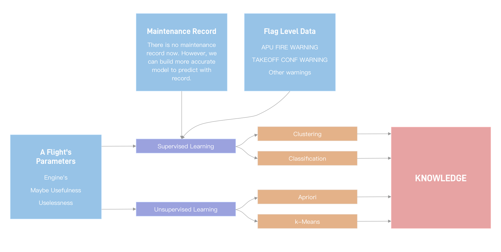

## Aviation Data Mining

### Abstract

Twentieth-century airplanes generated a lot of data. Large scale of aviation datasets make predictive maitenance models possible. In order to assure the feasible of  data mining, we consult some reports of aviation data analytics. 

According to a 2016 estimate by Oliver Wyman, by 2026, annual data generation should reach 98 billion gigabytes, or 98 million terabytes. The newest generation aircraft by then will be spewing out between five and eight terabytes per flight, up to 80 times what older planes today generate. These datasets are mainly used in aircraft health monitoring (AHM) andpredictive maintenance (PM) systems.

Besides, Oliver's report also shows that half of maintenance engineers use Aircraft Health Monitor(AHM) and 89% of them apply AHM for engine maintenance. Obviously, This is because engine maintenance is the main part and the costliest part of Aircraft Maintenanc. So, we concentrate on engine maintenance prediction.

There are many aviation datasets. For example, NASA has provided about 180GB actual data recorded onboard a single type of regional jet operating in commercial service over a three-year period. Our main research is based on this dataset.

### Related Studies

As data science developing, many data mining models and a lot of aviation data  analytics models have been published.

Quite a lot cademy institutions and companies have studied the aviation data analytics in order to make prediction espically in terms of aircraft engine. For example《A model to predict the residual life of aircraft engines based upon oil analysis data》, 《Exergetic and exergoeconomic analysis of an Aircraft Jet Engine (AJE)》, 《Recent Advancements in Aircraft Engine Health Management (EHM) Technologies and Recommendations for the Next Step 》etc.

Based on their study, we could find many useful conclusions.

### Initial Process and Technology Structure

### Citation

1. MRO BIG DATA – A LION OR A LAMB?  INNOVATION AND ADOPTION IN AVIATION MRO [Link](https://www.oliverwyman.com/content/dam/oliver-wyman/global/en/2016/apr/NYC-MKT9202-001MRO-Survey-2016_web.pdf)
2. GLOBAL FLEET & MRO MARKET FORECAST SUMMARY 2017-2027 [link](https://www.oliverwyman.com/content/dam/oliver-wyman/v2/publications/2017/feb/2017%20Global%20Fleet%20MRO%20Market%20Forecast%20Summary%20Final_Short%20Version_1.pdf)
3. Forbes - The Data Science Revolution That's Transforming Aviation [link](https://www.forbes.com/sites/oliverwyman/2017/06/16/the-data-science-revolution-transforming-aviation/#2172231f7f6c)
4. Balli, Ozgur & Aras, Haydar & Aras, Nil & Hepbasli, Arif. (2008). Exergetic and exergoeconomic analysis of an Aircraft Jet Engine (AJE). International Journal of Exergy. 5. 567-581. 10.1504/IJEX.2008.020826. 
5. Jaw, Link. (2005). Recent Advancements in Aircraft Engine Health Management (EHM) Technologies and Recommendations for the Next Step. 10.1115/GT2005-68625. 
6. Wang W, Zhang W. A model to predict the residual life of aircraft engines based upon oil analysis data[J]. Naval Research Logistics (NRL), 2005, 52(3): 276-284.

### Parameter

VAR_1107: SYNC WORD FOR SUBFRAME 1

VAR_2670: SYNC WORD FOR SUBFRAME 2

VAR_5107: SYNC WORD FOR SUBFRAME 3

VAR_6670: SYNC WORD FOR SUBFRAME 4

**FPAC**: FLIGHT PATH ACCELERATION——路径速度

**BLAC**: BODY LONGITUDINAL ACCELERATION——经度速度

**LONG**: LONGITUDINAL ACCELERATION——经度速度

**CTAC**: CROSS TRACK ACCELERATION——交叉速度

**TH**: TRUE HEADING LSP ——真航向

**MH**: MAGNETIC HEADING LSP ——[磁航向](https://baike.baidu.com/item/磁航向)

**EGT.1**: EXHAUST GAS TEMPERATURE 1——燃气温度

**EGT.2**: EXHAUST GAS TEMPERATURE 2——应该是四个发动机的

**EGT.3**: EXHAUST GAS TEMPERATURE 3——同上

**EGT.4**: EXHAUST GAS TEMPERATURE 4——同上

**IVV**: INERTIAL VERTICAL SPEED LSP——惯性垂直速度

**GS**: GROUND SPEED LSP——地面速度

**TRK**: TRACK ANGLE TRUE LSP——真航向角

**TRKM**: TRACK ANGLE MAG LSP——磁航向角

**DA**: DRIFT ANGLE——漂移角度

**POVT**: PYLON OVERHEAT ALL ENGINES——挂载过热的全部发送机

**WS**: WIND SPEED——风速

**MW**: MASTER WARNING——主警告

**DFGS**: DFGS 1&2 MASTER——Dual Fuel Generator Sets 双燃料发电机组 

**WD**: WIND DIRECTION TRUE——真风向

**ALT**: PRESSURE ALTITUDE LSP——压力高度

**NSQT**: SQUAT SWITCH NOSE MAIN GEAR——一个主起落架的开关

**RALT**: RADIO ALTITUDE LSP——无线电高度

**ALTR**: ALTITUDE RATE——海拔高度

**FQTY.1**: FUEL QUANTITY TANK 1 LSB——燃油数量

**FQTY.2**: FUEL QUANTITY TANK 2 LSB——同上

**FQTY.3**: FUEL QUANTITY TANK 3 LSB——同上

**FQTY.4**: FUEL QUANTITY TANK 4 LSB ——同上

**OIT.1**: OIL TEMPERATURE 1——汽油温度

**OIT.2**: OIL TEMPERATURE 2——同上

**OIT.3**: OIL TEMPERATURE 3——同上

**OIT.4**: OIL TEMPERATURE 4——同上

**AOA1**: ANGLE OF ATTACK 1——攻击角度

**AOA2**: ANGLE OF ATTACK 2——同上

**PTCH**: PITCH ANGLE LSP——间距角

**ROLL**: ROLL ANGLE LSP——侧倾角

**FF.1**: FUEL FLOW 1——燃料流量

**FF.2**: FUEL FLOW 2——同上

**FF.3**: FUEL FLOW 3——同上

**FF.4**: FUEL FLOW 4——同上

**PSA**: AVARAGE STATIC PRESSURE LSP——平均静压

**N1.1**: FAN SPEED 1 LSP——风扇转速（发动机）

**N1.2**: FAN SPEED 2 LSP——同上

**N1.3**: FAN SPEED 3 LSP——同上

**N1.4**: FAN SPEED 4 LSP——同上

**MACH**: MACH LSP——马赫

**CAS**: COMPUTED AIRSPEED LSP——计算出的空速

**APFD**: AP FD STATUS——驾驶状态，0一般表示地面，1为手动驾驶，2为自动驾驶

**PH**: FLIGHT PHASE FROM ACMS——0=Unknown、1=Preflight、2=Taxi、3=Takeoff、4=Climb、5=Cruise、6=Approach、7=Rollout， MAX ALLOWABLE AIRSPEED

**TAS**: TRUE AIRSPEED LSP——真空速

**VRTG**: VERTICAL ACCELERATION——垂直速度

**LATG**: LATERAL ACCELERATION——横向速度

**PI**: IMPACT PRESSURE LSP——影响压力

**PS**: STATIC PRESSURE LSP——静态压力

**PT**: TOTAL PRESSURE LSP——总压力

**EVNT**: EVENT MARKER——事件标记

**MRK**: MARKERS- INNER, MIDDLE, OUTER——内中外事件标记

**VIB.1**: ENGINE VIBRATION 1——发动机震动

**VIB.2**: ENGINE VIBRATION 2——同上

**VIB.3**: ENGINE VIBRATION 3——同上

**VIB.4**: ENGINE VIBRATION 4——同上

**VHF1**: VHF KEYING #1——超高频密钥？

**VHF2**: VHF KEYING #2——同上

**VHF3**: VHF KEYING #3——同上

**LGDN**: GEARS L&R DOWN LOCKED——起落架下降是否关闭

**LGUP**: GEARS L&R UP LOCKED——起落架上升是否关闭

**PUSH**: STICK PUSHER——推杆器

**SHKR**: STICK SHAKER——抖杆器

**MSQT.1**: SQUAT SWITCH LEFT MAIN GEAR——左侧起落架开关

**MSQT.2**: SQUAT SWITCH RIGHT MAIN GEAR——同上

**HYDY**: LOW HYDRAULIC PRESSURE YELLOW——低水力

**HYDG**: LOW HYDRAULIC PRESSURE GREEN——同上

**SMOK**: SMOKE WARNING——烟雾警告

**CALT**: CABIN HIGH ALTITUDE——机舱高度

**PLA.1**: POWER LEVER ANGLE 1——动力杠杆角度

**PLA.2**: POWER LEVER ANGLE 2——同上

**PLA.3**: POWER LEVER ANGLE 3——同上

**PLA.4**: POWER LEVER ANGLE 4——同上

**GMT.HOUR**: GREENWICH MEAN TIME (HOUR)——时间/小时

**GMT.MINUTE**: GREENWICH MEAN TIME (MINUTE)——时间/分

**GMT.SEC**: GREENWICH MEAN TIME (SECOND)——时间/秒

**ACMT**: ACMS TIMING USED T1HZ——应该是时间参数

**DATE.YEAR**: Date (Year) ——年

**DATE.MONTH**: Date (Month) ——月

**DATE.DAY**: Date (Day) —— 日

**DVER.1**: DATABASE ID VERSION CHAR 1 ——数据库版本

**DVER.2**: DATABASE ID VERSION CHAR 2 ——同上

**ACID**: AIRCRAFT NUMBER ——飞行器编码

**BLV**: BLEED AIR ALL VALVES ——引气全部气阀

**EAI**: ENGINE ANTICE ALL POSITIONS ——发动机位置ANTICE

**PACK**: PACK AIR CONDITIONING ALL——空调？

**AOAI**: INDICATED ANGLE OF ATTACK——显示攻击速度

**AOAC**: CORRECTED ANGLE OF ATTACK——调整后攻击速度

**BAL1**: BARO CORRECT ALTITUDE LSP——斜压海拔高度修正

**BAL2**: BARO CORRECT ALTITUDE LSP——同上

**APUF**: APU FIRE WARNING—— Auxiliary power unit 辅助动力装置火灾警告

**TOCW**: TAKEOFF CONF WARNING——起飞装置警告

**WSHR**: WINDSHEAR WARNING——风火警告

**WOW**: WEIGHT ON WHEELS——0表示在地上 1表示在空中

**N2.1**: CORE SPEED 1 LSP——核心速度

**N2.2**: CORE SPEED 2 LSP——同上

**N2.3**: CORE SPEED 3 LSP——同上

**N2.4**: CORE SPEED 4 LSP——同上

**TAT**: TOTAL AIR TEMPERATURE——总空气温度

**SAT**: STATIC AIR TEMPERATURE——静态空气温度

**N1T**: N1 TARGET LSP——类似下方

**N1C**: N1 COMMAND LSP——飞机推力的替代值（无法直接表达）

**RUDD**: RUDDER POSITION——舵位

**OIP.1**: OIL PRESSURE 1 ——汽油压力

**OIP.2**: OIL PRESSURE 2 ——同上

**OIP.3**: OIL PRESSURE 3——同上

**OIP.4**: OIL PRESSURE 4——同上

**CRSS**: SELECTED COURSE ——航向选择，自动驾驶

**HDGS**: SELECTED HEADING ——航向选择，自动驾驶

**ALTS**: SELECTED ALTITUDE LSP——海拔选择，自动驾驶

**SNAP**: MANUAL SNAPSHOT SWITCH——人工驾驶开关

**CASS**: SELECTED AIRSPEED——空速选择，相对于空气/风的速度，自动驾驶

**N1CO**: N1 COMPENSATION——通常，在飞行的初始爬升和最后进近阶段，N1CO将为“1”

**VSPS**: SELECTED VERTICAL SPEED——垂直速度选择，自动驾驶

**MNS**: SELECTED MACH——马赫速度选择，自动驾驶

**VMODE**: VERTICAL ENGAGE MODES——垂直状态，LMOD中：选择可以是前进，仪器着陆，捕获或跟随飞行员命令；在VMOD中：选择可以是速度，高度，垂直速度，飞行路径，滑行斜率或跟随飞行员命令

**LMOD**: LATERAL ENGAGE MODES——横向状态

**A/T**: THRUST AUTOMATIC ON——1表示打开了自动油门

**CCPC**: CONTROL COLUMN POSITION CAPT——控制栏位置限制

**CCPF**: CONTROL COLUMN POSITION F/O——控制栏位置F/O

**RUDP**: RUDDER PEDAL POSITION——舵踏板位置

**CWPC**: CONTROL WHEEL POSITION CAPT——控制轮位置限制

**CWPF**: CONTROL WHEEL POSITION F/O——控制轮位置F/O

**LOC**: LOCALIZER DEVIATION——航向偏差

**GLS**: GLIDESLOPE DEVIATION——下滑道偏差

**LONP**: LONGITUDE POSITION LSP——经度位置

**ABRK**: AIRBRAKE POSITION——气闸位置

**AIL.1**: AILERON POSITION LH——副翼位置

**AIL.2**: AILERON POSITION RH——同上

**SPL.1**: ROLL SPOILER LEFT——左侧气流偏转器旋转

**SPL.2**: ROLL SPOILER RIGHT——同上

**ECYC.1**: ENGINE CYCLE 1 LSP——发动机转速

**ECYC.2**: ENGINE CYCLE 2 LSP——同上

**ECYC.3**: ENGINE CYCLE 3 LSP——同上

**ECYC.4**: ENGINE CYCLE 4 LSP——同上

**ELEV.1**: ELEVATOR POSITION LEFT——左侧电梯位置

**ELEV.2**: ELEVATOR POSITION RIGHT——右侧电梯位置

**FLAP**: T.E. FLAP POSITION——T.E. 襟翼位置

**PTRM**: PITCH TRIM POSITION——俯仰配平位置

**HF1**: HF KEYING #1——增量频率键控

**HF2**: HF KEYING #2——同上

**SMKB**: ANIMAL BAY SMOKE

**SPLY**: SPOILER DEPLOY YELLOW——气流偏转器

**SPLG**: SPOILER DEPLOY GREEN——同上

**FRMC**: FRAME COUNTER——框架计数器

**BPGR.1**: BRAKE PRESSURE LH GREEN——刹车压力

**BPGR.2**: BRAKE PRESSURE RH GREEN——同上

**BPYR.1**: BRAKE PRESSURE LH YELLOW——同上

**BPYR.2**: BRAKE PRESSURE RH YELLOW——同上

**TCAS**: TCAS LSP——[空中防撞系统](https://zh.wikipedia.org/zh-sg/空中防撞系统)

**GPWS**: GPWS 1-5——[地面迫近警告系統](https://zh.wikipedia.org/zh/地面迫近警告系統)

**TMAG**: TRUE/MAG HEADING SELECT——真/磁航向

**TAI**: TAIL ANTICE ON——尾翼ANTICE

**WAI.1**: INNER WING DEICE——内部机翼

**WAI.2**: OUTER WING ANTICE——外部机翼ANTICE

**DWPT**: DISTANCE TO WAYPOINT LSP——据说是达到目的地的距离

**OIPL**: LOW OIL PRESSURE ALL ENGINES——全部发动机的低汽油压

**FADF**: FADEC FAIL ALL ENGINES——全部发动机的[全权数字发动机控制](https://zh.wikipedia.org/zh-sg/全权数字发动机控制)失败

**FADS**: FADEC STATUS ALL ENGINES——全部发动机的[全权数字发动机控制](https://zh.wikipedia.org/zh-sg/全权数字发动机控制)状态

**EHRS.4**: ENGINE HOURS 4 LSP——应该是发动机运行时间

**EHRS.3**: ENGINE HOURS 3 LSP——同上

**EHRS.2**: ENGINE HOURS 2 LSP——同上

**EHRS.1**: ENGINE HOURS 1 LSP——同上

**TMODE**: THRUST MODE——官方宣称不明

**ATEN**: A/T ENGAGE STATUS——油门状态，1表示自动油门

**LATP**: LATITUDE POSITION LSP——纬度位置

**FIRE.1**: ENGINE FIRE #1——应该是点火状态

**FIRE.2**: ENGINE FIRE #2——同上

**FIRE.3**: ENGINE FIRE #3——同上

**FIRE.4**: ENGINE FIRE #4——同上

**FGC3**: DFGS STATUS 3——区域因素组状态？

**ILSF**: ILS FREQUENCY LSP——[仪表着陆系统](https://zh.wikipedia.org/zh-hans/仪表着陆系统)频率

**ESN.1**: ENGINE SERIAL NUMBER 1 LSP——发动机系列代码，应该比如CFM56

**ESN.2**: ENGINE SERIAL NUMBER 2 LSP——同上

**ESN.3**: ENGINE SERIAL NUMBER 3 LSP——同上

**ESN.4**: ENGINE SERIAL NUMBER 4 LSP——同上