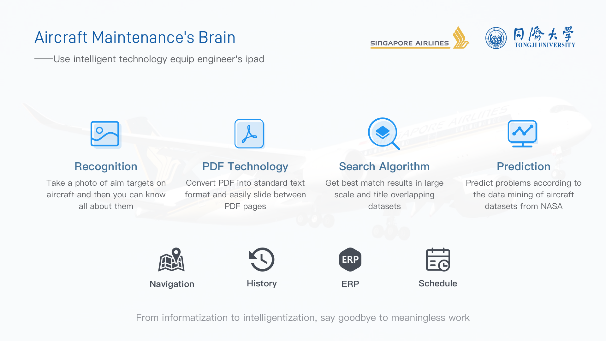
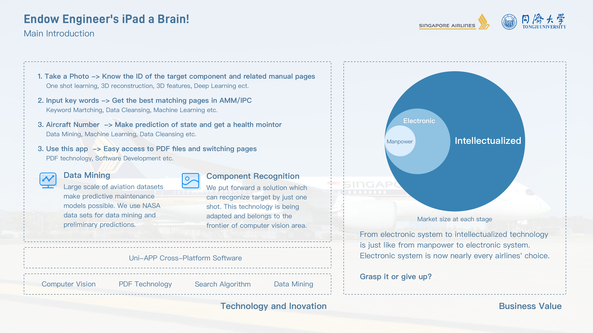
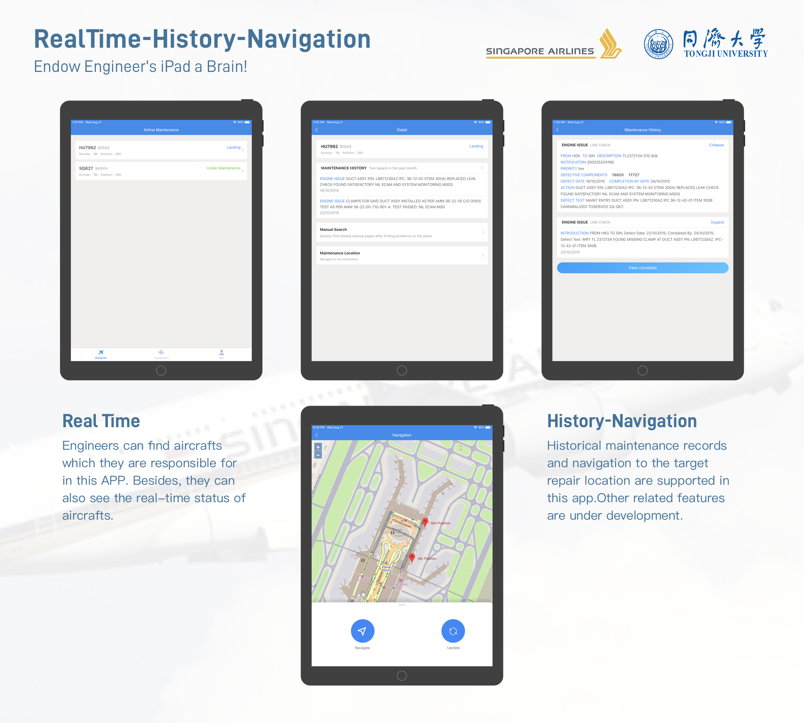
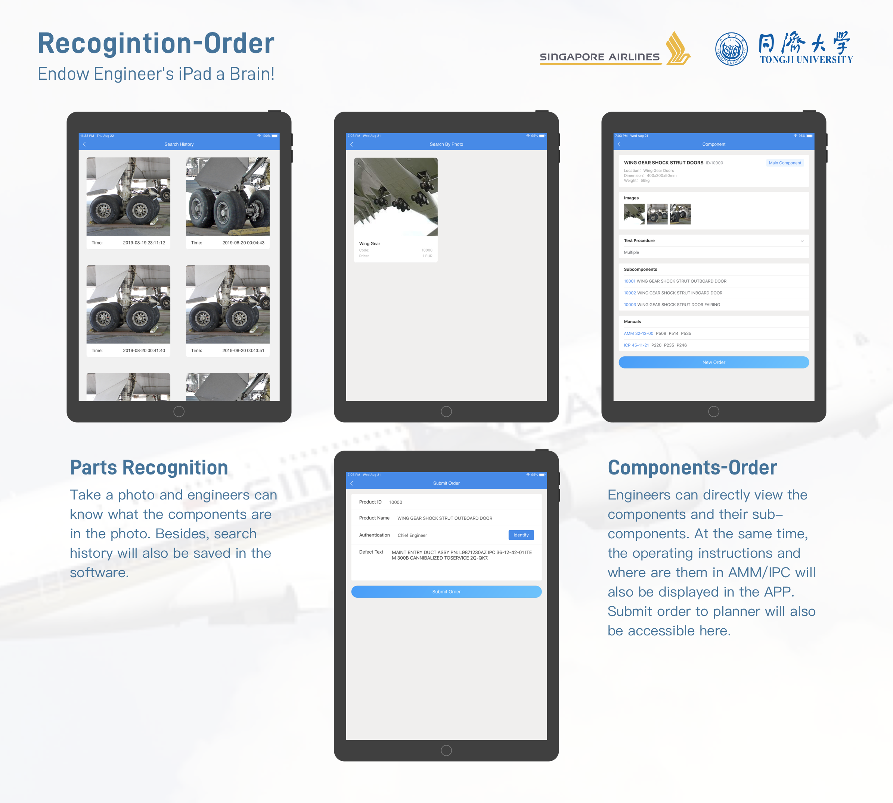

## Aircraft Maintenance's Brain - APP Challenge 2019

### Introduction

This repository is our project for APP Challenge 2019 Singapore Airlines. Introduction to our app, one-shot recognition algorithm, pdf processing algorithm, etc can be found in the readme file of every folder.

Author: Yang Shan, Wang Zilu, Ma Chang, Sun Yan from Tongji University

### What we have done？

